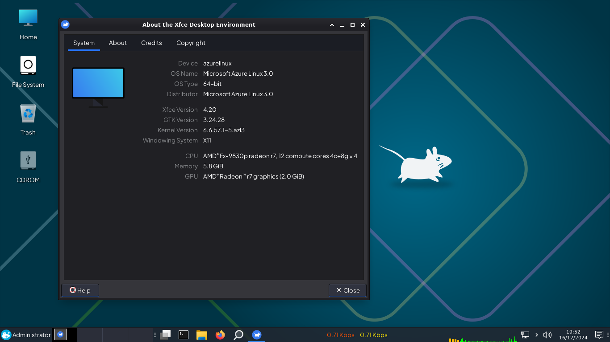

# Azure Linux Desktop Experience 

Azure Linux, previously known as CBL-Mariner (in which CBL stands for Common Base Linux), is a free and open-source Linux distribution that Microsoft has developed. It is the base container OS for Microsoft Azure cloud infrastructure, edge products services and the graphical component of Hyper-V and WSL 2. But in this time, i installed Xfce4 customized for Home Laptop.

